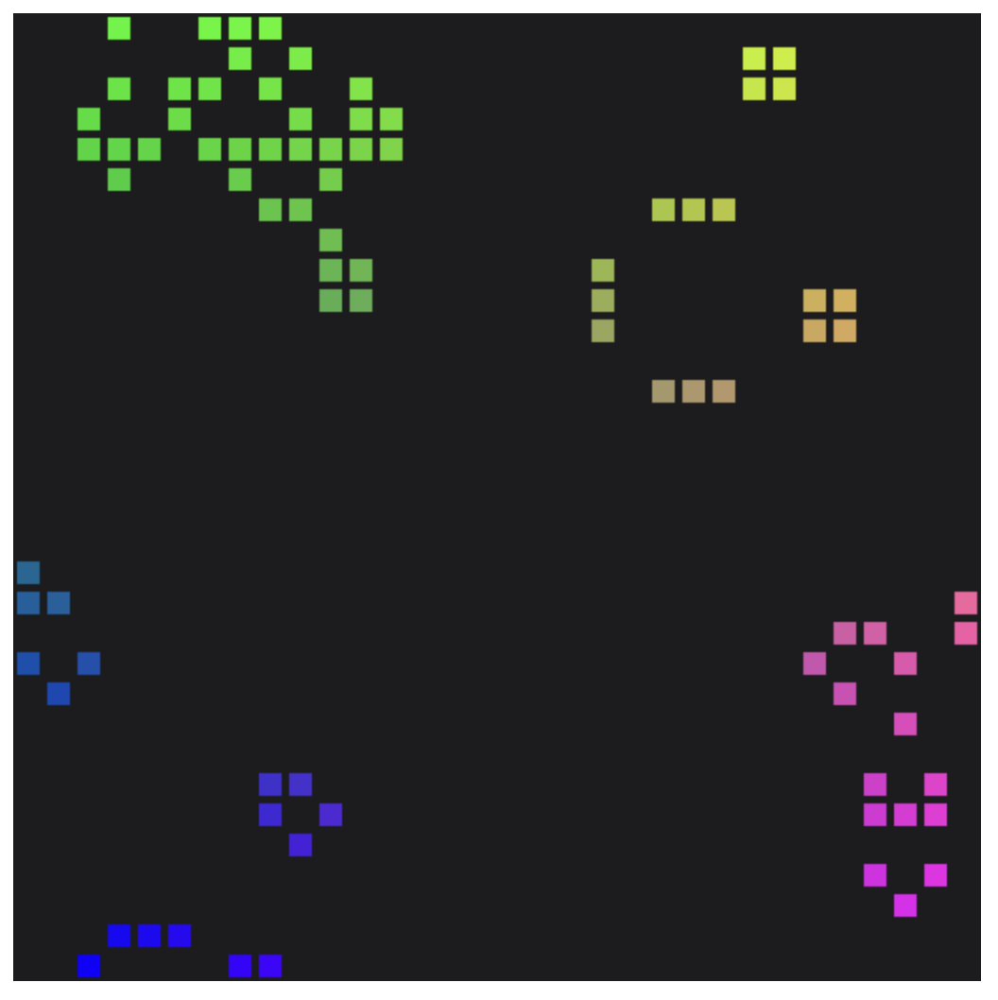

# WebGPU Life

A simple implementation of Conway's Game of Life using WebGPU.
Follows the [Getting Started with WebGPU][1] tutorial.



## Usage

Install npm dependencies.
```sh
npm install
```

Run the go server, bundling the assets with [esbuild][esbuild].
```sh
go run . --dev
```

Bundling based on [pkgsite][pkgsite].

[1]: https://codelabs.developers.google.com/your-first-webgpu-app#0
[esbuild]: https://esbuild.github.io/
[pkgsite]: https://github.com/golang/pkgsite
